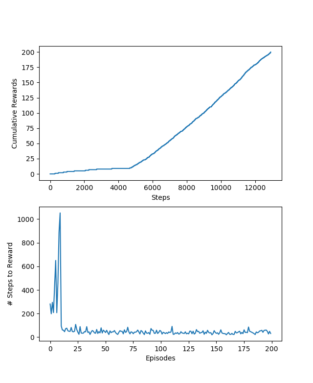
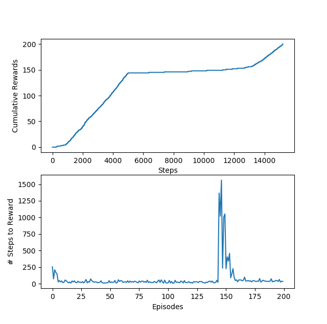
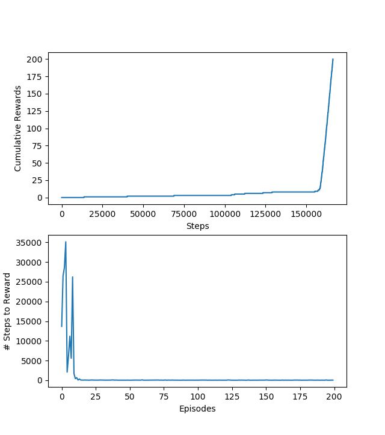
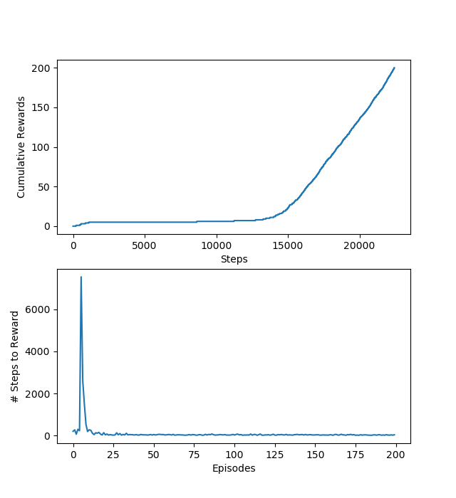
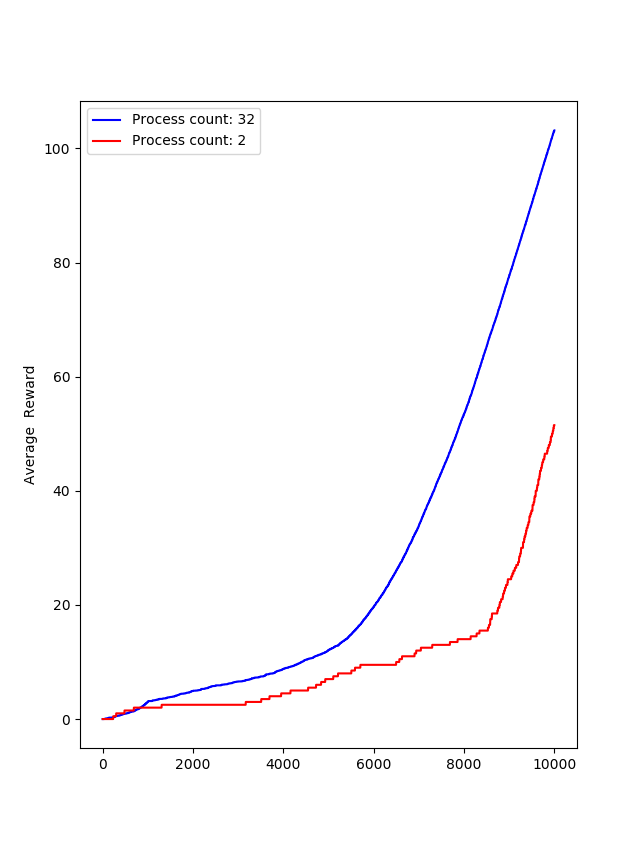

# q-learning
Q-Learning Coding Assignment

## Dependencies
* [numpy](http://www.numpy.org/)
* [matplotlib](https://matplotlib.org/)

The code is written in Python 2.7

The easiest way to **install** the required dependencies is to use the [Anaconda](https://www.continuum.io/what-is-anaconda) python distribution that bundles the best open source Python libraries for data science.
You can download it for your platform at [https://www.continuum.io/downloads](https://www.continuum.io/downloads)

## Description

This source code is written for a coding assignment.
It implements the Q-Learning algorithm to perform _reinforcement learning_.

**exercise1** implements the core algorithm

**exercise2** tries to improve the agent's performance by running multiple agents in parallel in a process pool who share their learning asynchronously.

### Literature
1. [Reinforcement Learning - Sutton, Barto](https://mitpress.mit.edu/books/reinforcement-learning)
2. [Asynchronous Methods for Deep Reinforcement Learning - Mnih et. al.](https://arxiv.org/abs/1602.01783)
 
# About the Source Code
## Thoughts on Classes
### Environment - Gridworld Model
`Environment.py` implements the Gridworld model. This is a simple maze with a starting grid cell and a goal cell that the agent has to navigate.
 The grid is 6 X 9 with an obstacle (aka "wall") between the agent - standing on the starting cell - and the goal. The obstacle moves after the 1000th step to be able to show that the agent can learn and then re-learn how to navigate the maze.
 
 ```
class GridWorldModel:   
```
The grid is not visualized.
 
The model maintains some state: _state_ is where the agent currently is, _step_count_ keeps track of the number of steps taken, so it can move the obstacle.
The grid is not explicitly modelled - this would be an improvement if more elaborate maze is needed. The obstacle is modelled in 
 ```
def would_hit_wall(self, delta_x, delta_y): 
```
The model represents the _state_ (s) and _action_ (a) taken as integer numbers when interacting with the agent. 
This has the benefit that the agent can easily use these numbers as indices in the **Q(s,a)** matrix used in Q-learning.
There are conversion methods that interpret the meaning of these numbers back and forth.

```
def state_to_xy(state): ...
def state_from_xy(x, y): ...
def action_from_ndx(ndx): ...
```
 
Unit tests for the model are in `test_gridWorldModel.py`

### Agent

`Agent.py` implements the agent, trying to learn how to navigate the maze.
Currently the _policy_ and the knowledge _representation_ are coded in the agent. If we were to extend this to a reinforcement learning library then these could be abstracted out and the agent would really just be orchestrating the learning process: relying on the policy its represented knwoledge to decide what action to take next, interacting with the model etc.

The agent is interacting with the _environment_.
The only things it needs from an _environment_ are:
* `get_number_of_states()` number of states - with each state represented by a unique integer index
* `get_number_of_actions()` number of actions
* `reward, new_state = self.environment.take_action(action)` taking an action and returning the new state it leads to and any reward

Note: the model does not tell the agent which actions are valid at each step. e.g. when on the top left corner of the grid the agent can only go down and right.
The agent figures this out on its own by observing the penalty for taking an action that leads to the same state.
It has similar penalty as moving back and forth in a loop.
e.g. ↑↓ vs. ↓ at a bottom row both lead to the agent being in the same state.

Unit tests for the agent are in `test_agent.py`

### Experiements

The two assignments are implemented in `experiement1.py` and `experiment2.py` respectively.

## Thoughts on the Experiments
### Experiment 1
There are two plots drawn after the experiment. The _cumulative rewards_ over time that the assignment asked for and the _number of steps taken to get a reward in each episode_ that I added.
In the specification of the Gridworld model the obstacle wall moves after the 1000th step.
In my experiments so far the learning takes longer, so the obstacle changing does not show on the plot.
It currently takes about 4-5000 steps for the agent to build a working model.



If I change the Gridworld such that the obstacle only shift after the 5000th step then the plot nicely shows that the agent has learned how to navigate the little maze, then started hitting the wall and then recovered, re-learned and is able to navigate it again.



I think the learning is currently too slow.
There should be a cost of making an unnecessary move 
Q(s, a) ← Q(s, a) + α r + γ max a Q(s' , a) − Q(s, a) .

Currently Q(s,a) starts out from all zeros, so the only thing in the formula that decreases the value is zero.
The agent does not know what are the valid moves so it can just start from the bottom row and try going out of bounds without getting a penalty for the move.
It basically takes a large number of random exploration until it finds the goal and gets a reward, before the value updates can kick in.

I tried to improve it by making the exploitation non-deterministic.

**before**

```python
import numpy as np

def exploit(self):
    return np.argmax(self.Q[self.state])
```

This will take a deterministic choice when all actions in a state have the same learned value... and this will stay 0 for a long while until the agent has at least once randomly stumbled on the goal and got a reward.



**after**

````python
import numpy as np
import random

def exploit(self):
    # when there are multiple options with the same Q value then choose among them randomly
    best_actions = np.argwhere(self.Q[self.state] == np.amax(self.Q[self.state]))
    return random.choice(best_actions.flatten().tolist())
````



### Experiment 2

I implemented the asynchronous Q-learning algorithm using [multiprocessing package]([https://docs.python.org/2/library/multiprocessing.html) form the Python standard library.

The experiment runs two process pools, first with 2 processes, then with 32 processes - to demonstrate the improvement in learning when there are more processes learning asynchronously.


